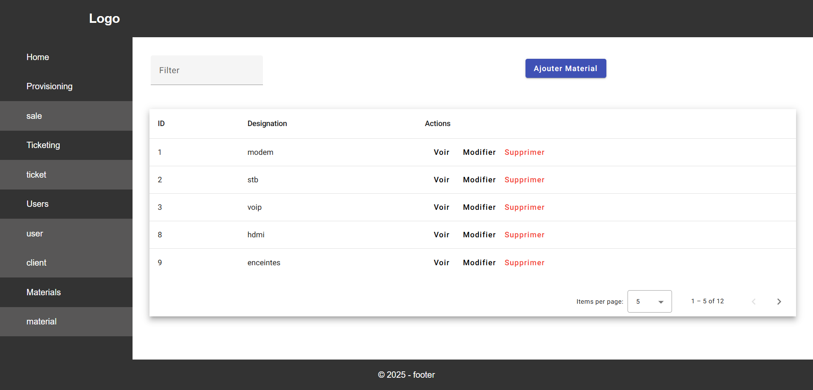
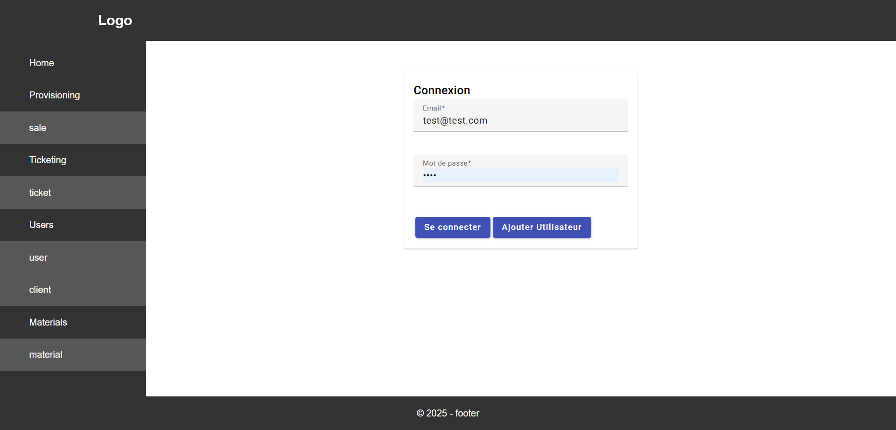
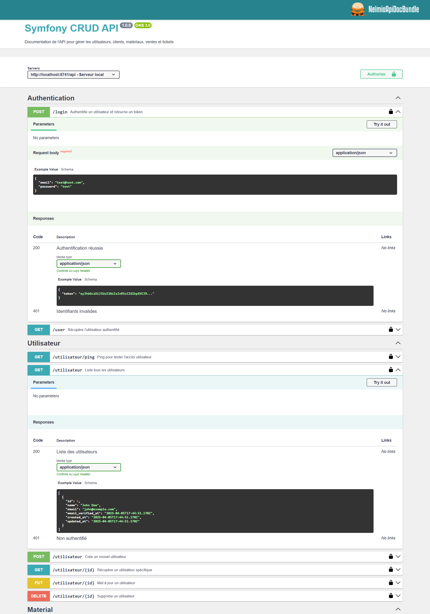
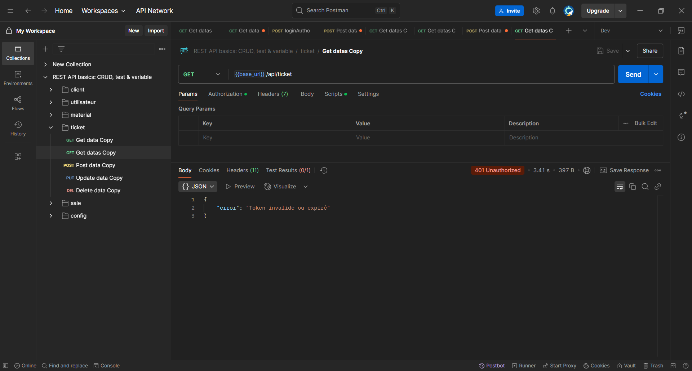

# CRUD Docker Symfony Angular

Simple CRUD avec API Symfony 6.4 et front-end Angular 19 et MySQL et phpMyAdmin sous Docker.


## Prérequis
- Docker
- Docker Compose


## Installation

- Construction du projet :
```bash  
git clone https://github.com/ghyslain12/symfony-docker-apache-angular.git
sudo chmod -R 777 symfony-docker-apache-angular/
cd symfony-docker-apache-angular
docker-compose up --build -d
docker exec -it symfony_app sh -c "composer install"
```  

## Utilisation docker

- Monter le conteneur :
```bash  
docker-compose up
```  
- Démonter le conteneur :
```bash  
docker-compose down
```  

## Fonctionnalités
- Back-end: Symfony Api JWT
- Front-end: Angular & JWT connexion / inscription
- Testing
- NelmioApiDocBundle (Swagger)
- Docker Apache Mysql

## Services
- Angular (front-end): http://localhost:4200
- Symfony (API): http://localhost:8741/api


## API [utilisateur, client, material, ticket, sale...]

Api NelmioApiDocBundle: http://localhost:8741/api/doc

### Créer un utilisateur
  **`/utilisateur`** Ajoute un nouvel utilisateur dans le système.

### Lister tous les utilisateurs
  **`/utilisateur`** Récupère la liste de tous les utilisateurs.

### Récupérer un utilisateur
  **`/utilisateur/{id}`** Récupère les détails d’un utilisateur spécifique par son ID.

### Mettre à jour un utilisateur
  **`/utilisateur/{id}`** Met à jour les informations d’un utilisateur existant.

### Supprimer un utilisateur
  **`/utilisateur/{id}`** Supprime un utilisateur spécifique par son ID.

## JWT

### Récupérer un token
  **`/login`** Authentifie un utilisateur et retourne un token.

- Activer (.env): JWT_ENABLE=true
- Désactiver (.env): JWT_ENABLE=false

## Aperçu








